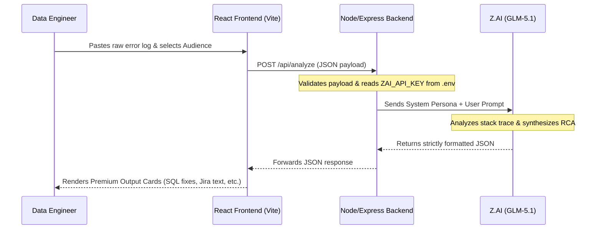

<div align="center">
  
  
  
  
  <h1>🚀 AI DataOps Incident Copilot</h1>
  <p><strong>Transforming raw ETL & SQL pipeline failures into actionable, executive-ready insights in seconds.</strong></p>
</div>

---

## 📖 Overview

**AI DataOps Incident Copilot** is an elite, enterprise-grade application built specifically for modern Data Engineering and DevOps teams. 

When a critical data pipeline fails (whether in Redshift, Snowflake, AWS Glue, Informatica, or Airflow), finding the root cause from raw, massive stack traces can take hours. This application leverages the power of **Z.AI (GLM-5.1)** to instantly diagnose the issue and generate a complete Incident Root Cause Analysis (RCA) package.

## 🛑 The Problem

Data engineering teams lose massive amounts of time during pipeline failures because:
1. Raw logs are cryptic and hard to decipher.
2. Root Cause Analysis (RCA) takes hours, delaying time-to-resolution (TTR).
3. Jira incident updates are manual and tedious.
4. Non-technical leadership and customers often lack clear, jargon-free updates regarding business impact.

## 💡 The Solution

This app reduces incident analysis time from **hours to seconds** by converting raw technical failures into:

- 📊 **Executive Summary**
- 🔍 **Root Cause Analysis (RCA)**
- 💼 **Business Impact Assessment**
- 🛠 **Fixed SQL or ETL Logic**
- ✅ **Validation Query**
- 🎫 **Jira-Ready Ticket Update**
- 📢 **Customer-Facing Status Update**
- 🛡️ **Prevention Checklist**

---

## 🏗️ Architecture & Flow Diagram

The application uses a decoupled frontend/backend architecture to ensure security and scalability. 



---

## ⚙️ Tech Stack

- **Frontend**: React 18, Vite, Vanilla CSS (Premium Enterprise Dashboard Design), Lucide Icons
- **Backend**: Node.js, Express.js, CORS
- **AI Integration**: OpenAI Node SDK pointing to `api.z.ai`
- **Model**: `glm-5.1`

---

## 🚀 Getting Started

Follow these instructions to get the project up and running on your local machine.

### Prerequisites

- Node.js (v18 or higher recommended)
- npm or yarn
- A valid **Z.AI API Key**

### 1. Setup the Backend

The backend is responsible for securely communicating with the AI model. **Never expose your API keys in the frontend code.**

```bash
# 1. Navigate to the backend directory
cd backend

# 2. Install dependencies
npm install

# 3. Setup your environment variables
cp .env.example .env
```

> **⚠️ CRITICAL SECURITY NOTE - API KEYS**
> Open the newly created `backend/.env` file and paste your Z.AI API key:
> `ZAI_API_KEY=your_actual_api_key_here`
> 
> *Do not commit this `.env` file to GitHub! The provided `.gitignore` is already configured to prevent this.*

```bash
# 4. Start the backend server
npm start
# The server will start on http://localhost:4000
```

### 2. Setup the Frontend

Open a **new terminal window/tab** for the frontend.

```bash
# 1. Navigate to the frontend directory
cd frontend

# 2. Install dependencies
npm install

# 3. Start the Vite development server
npm run dev
# The UI will be available at http://localhost:5173
```

---

## 🎮 How to Use the App

1. Open `http://localhost:5173` in your browser.
2. Under the **"Try a Sample"** section, click on one of the pre-loaded failure scenarios (e.g., *Redshift numeric overflow*).
3. Select your target audience (e.g., *Leadership*, *Engineering*, *Full Package*).
4. Click **Analyze Incident**.
5. Within seconds, the dashboard will populate with the RCA, Validation Queries, and Copy-Paste ready Jira/Customer updates!

---

## 🛡️ Security & Best Practices

- **Zero Client-Side Secrets**: The Z.AI API key is exclusively loaded into the Node.js backend environment via `dotenv`. The React frontend never sees the key.
- **Prompt Engineering**: The backend uses a heavily engineered system prompt to force the LLM into returning strict, parseable JSON, preventing markdown leakage and ensuring stable UI rendering.
- **CORS Configuration**: The backend currently uses wide-open CORS for local development. In a production scenario, configure `cors({ origin: 'your-production-domain.com' })`.

---

## 🏆 Hackathon Pitch

**"In today's data-driven world, a broken data pipeline doesn't just block analytics—it halts the business. Our team built the AI DataOps Incident Copilot to stop engineers from acting as human log-parsers. By turning cryptic stack traces into actionable Jira updates, fixed SQL, and executive summaries in seconds, we are giving data teams their time back and keeping stakeholders informed."**

---

## 🔮 Future Enhancements

- [ ] **Direct Jira Integration**: Automatically create/update Jira tickets via the Jira REST API.
- [ ] **Slack/Teams Webhooks**: Broadcast the customer-facing summary directly to an `#incidents` channel.
- [ ] **Airflow/dbt Plugin**: Allow tools to push failures directly to the Copilot backend without manual copy-pasting.
- [ ] **Historical Knowledge Base**: Vector DB integration to reference past identical failures and their fixes.
